# ErgoDonk Zero Keyboard
## **THIS IS A WORK IN PROGRESS AND NOT PRODUCTION READY**
ErgoDonk Zero is a 6×9+6 keys split ortholinear keyboard with encoder & solenoid support, hotswap sockets for MX or Choc v1 low profile switches, and uses the RP2040 "Zero" MCU.

The ErgoDonk Zero was designed by [Ryan Neff](https://github.com/JellyTitan). Many of the footprints came from the well-regarded foostan [kbd library](https://github.com/foostan/kbd). 

[Overview](#overview)
 - [Design philosophy](#design-philosophy)

[Bill of Materials](#bill-of-materials)
 - [Required Parts](#required-parts)
 - [Optional - PCB screw in Stabilizers](#optional---pcb-screw-in-stabilizers)
 - [Optional - Solenoid](#optional---solenoid)
 - [Optional - Case plates](#optional---case-plates)
 - [Optional - 3d printed case](#optional---3d-printed-case)
 - [Optional - low profile header pins](#optional---low-profile-header-pins)
 - [Tools and materials](#tools-and-materials)

[Build Guide / Assembly steps](#build-guide--assembly-steps)
 - [Prepare](#prepare)
 - [Soldering](#soldering)
 - [Diodes](#diodes)
 - [Switch Sockets](#switch-sockets)
 - [Jumpers](#jumpers)
 - [Pi Zero MCU](#pi-zero-mcu)
 - [TRRS Jacks](#trrs-jacks)
 - [Rotary Encoders](#rotary-encoders)
 - [Final assembly](#final-assembly)
 - [Warnings and disclaimers](#warnings-and-disclaimers)
 - [Firmware and programming](#firmware-and-programming)

[Troubleshooting](#troubleshooting)
 - @todo crib this section from Junco?
 - [An entire row or column of keys is not working](#an-entire-row-or-column-of-keys-is-not-working)
 - [Random key or keys not working](#random-key-or-keys-not-working)
[Version History](#version-history)
[Future feature wish list](#future-feature-wish-list)

## Overview
The ErgoDonk Zero was designed to be a good first split ortholinear keyboard. It is inexpensive, the parts are accessable, it's easy to build, and has a key layout that is still familiar to non-split querty users. 

It can be used with any MX [keycap profile](https://www.reddit.com/r/MechanicalKeyboards/comments/j484j5/keycap_profiles_i_compiled_a_direct_comparison/), but is designed specifically for the ergonomic SA Keycap profile. The E0 has been designed to use off the shelf keycap sets. The layout [leverages](http://www.keyboard-layout-editor.com/##@_backcolor=%23264653&name=ErgoDonk%20Zero%20Keycap%20heights&author=https%2F:%2F%2F%2F%2Fgithub.com%2F%2Fjellytitan%3B&@_y:0.25&x:1&c=%23e76f51&a:7%3B&=R1&_x:0.25%3B&=R1&=R1&=R1&=R1&_x:0.25%3B&=R1&=R1&_x:4%3B&=R1&=R1&_x:0.25%3B&=R1&=R1&=R1&=R1&_x:0.25%3B&=R1%3B&@_y:0.25&x:4.5%3B&=R1&_x:10%3B&=R1%3B&@_y:-0.75&x:3.5%3B&=R1&_x:1%3B&=R1&_x:8%3B&=R1&_x:1%3B&=R1%3B&@_y:-0.75&x:1.5%3B&=R1&=R1&_x:3%3B&=R1&_x:6%3B&=R1&_x:3%3B&=R1%3B&@_y:-0.75&x:7.5%3B&=R1&_x:0.25%3B&=R1&_x:1.5%3B&=R1&_x:0.25%3B&=R1&_x:5%3B&=R1&=R1&_w:2%3B&=R1%3B&@_y:-0.75&x:4.5&c=%23f4a261%3B&=R2&_x:10%3B&=R2%3B&@_y:-0.75&x:3.5%3B&=R2&_x:1%3B&=R2&_x:8%3B&=R2&_x:1%3B&=R2%3B&@_y:-0.75&x:1&w:1.5%3B&=R2&=R2&_x:3%3B&=R2&_x:6%3B&=R2&_x:3%3B&=R2%3B&@_y:-0.75&x:7.5%3B&=R2&_x:0.25&c=%23e76f51%3B&=R1&_x:1.5%3B&=R1&_x:0.25&c=%23f4a261%3B&=R2&_x:5%3B&=R2&=R2&_w:1.5%3B&=R2%3B&@_y:-0.75&x:4.5&c=%23e9c46a%3B&=R3&_x:10%3B&=R3%3B&@_y:-0.75&x:3.5%3B&=R3&_x:1&n:true%3B&=R3&_x:8&n:true%3B&=R3&_x:1%3B&=R3%3B&@_y:-0.75&x:0.75&w:1.75%3B&=R3&=R3&_x:3%3B&=R3&_x:6%3B&=R3&_x:3%3B&=R3%3B&@_y:-0.75&x:7.5%3B&=R3&_x:0.25&c=%23e76f51%3B&=R1&_x:1.5%3B&=R1&_x:0.25&c=%23e9c46a%3B&=R3&_x:5%3B&=R3&_w:2.25%3B&=R3%3B&@_y:-0.75&x:4.5&c=%232a9d8f%3B&=R4&_x:10%3B&=R4%3B&@_y:-0.75&x:3.5%3B&=R4&_x:1%3B&=R4&_x:8%3B&=R4&_x:1%3B&=R4%3B&@_y:-0.75&x:0.25&w:2.25%3B&=R4&=R4&_x:3%3B&=R4&_x:6%3B&=R4&_x:3%3B&=R4%3B&@_y:-0.75&x:7.5%3B&=E&_x:4%3B&=E&_x:5&w:2.75%3B&=R4%3B&@_y:-0.75&x:4.5&p=R1%3B&=R4&_x:10%3B&=R4%3B&@_y:-0.75&x:3.5%3B&=R4&_x:12%3B&=R4%3B&@_y:-0.75&w:1.25%3B&=R4&_w:1.25%3B&=R4&=R4&_x:14%3B&=R4%3B&@_y:-0.75&x:18.5&w:1.25%3B&=R4&_w:1.25%3B&=R4%3B&@_r:8&rx:10.6&ry:1&y:4.75&x:-1.3000000000000007&c=%23e76f51%3B&=R1%3B&@_x:-3.3&c=%23e9c46a&h:2%3B&=R3&_c=%232a9d8f&h:2%3B&=R4&_c=%23f4a261%3B&=R2%3B&@_y:-0.25&x:-4.3&c=%232a9d8f&h:1.25%3B&=R4%3B&@_y:-0.75&x:-1.3000000000000007&c=%23e9c46a%3B&=R3%3B&@_r:-8&y:-3&x:0.09999999999999964&c=%23e76f51%3B&=R1%3B&@_x:0.09999999999999964&c=%23f4a261%3B&=R2&_c=%232a9d8f&fa@:4%3B&h:2%3B&=R4&_c=%23e9c46a&f:4&h:2%3B&=R3%3B&@_y:-0.25&x:3.0999999999999996&c=%232a9d8f&f:3&h:1.25%3B&=R4%3B&@_y:-0.75&x:0.09999999999999964&c=%23e9c46a%3B&=R3) the variable height profile of SA keycaps. 

## Design philosophy
The ErgoDonk Zero is designed with the following goals:
* Comfort & ergonomics
  * Ortholinear.
  * Split.
  * Tiltable. Has tenting puck mounting holes. [SplitKB](https://splitkb.com/products/tenting-puck) or 3d print your own: design by [
Bubbleology](https://www.printables.com/model/235433-tenting-puck-for-keyboard-tripod-mount/comments/943096).
  * Thumb clusters designed to use SA variable height keycaps
* Accessible
  * Uses standard key cap sets. 
  * Can use either MX or Choc V1 low profile key switches.
  * Through-hole components used for easy soldering.
  * "Drag and drop" MCU flashing.
  * Uses VIA for easy customization.
  * [Supports more keys](http://www.keyboard-layout-editor.com/#/gists/ac776db3b0deef94de51943c384cfdfc) than a traditional split ergo, making it a good transition to a smaller split, or for those who really like their "F" keys.
* Low cost
  * The PCB is reversible to reduce manufacturing costs.
  * Uses RP2040 Zero. (Inexpensive clones are readily available for ~$3USD)
  * Does not require expensive split-specific key cap sets.

## Bill of materials
### Required Parts

| Name | Count | Remarks | Potential Storefront | Image |
| ---- | ----- | ------- | -------------------- | ----- |
| PCB | 2 | The PCB should be 1.6mm thick. I used JLCPCB's default settings only customizing the PCB color, and selecting 'lead free'. | Manufacturers such as JLCPCB, PCBWay, and Elecrow. [Price comparison tool](https://pcbshopper.com/) |  |
| Hot-swap Sockets | 101 | The PCB requires sockets. Switches cannot be soldered directly to the board.   Either MX or Choc low profile sockets.    When shopping for MX sockets, try to avoid the variant that has a metal tab in the center of the socket. This makes it harder to get the soldering iron in there. I've only encountered this tab when buying black MX sockets in bulk (500+) from AliExpress. I've _not_ encountered that problem with Kailh & Durock colored sockets. In the image to the right, the black socket has the troublesome tab. | [Amazon MX]( https://www.amazon.com/DUROCK-Mechanical-Keyboard-Switches-Hot-Swap/dp/B0B4WCKWLZ/ )    [Aliexpress MX & Choc](https://www.aliexpress.us/item/3256803687338432.html) |    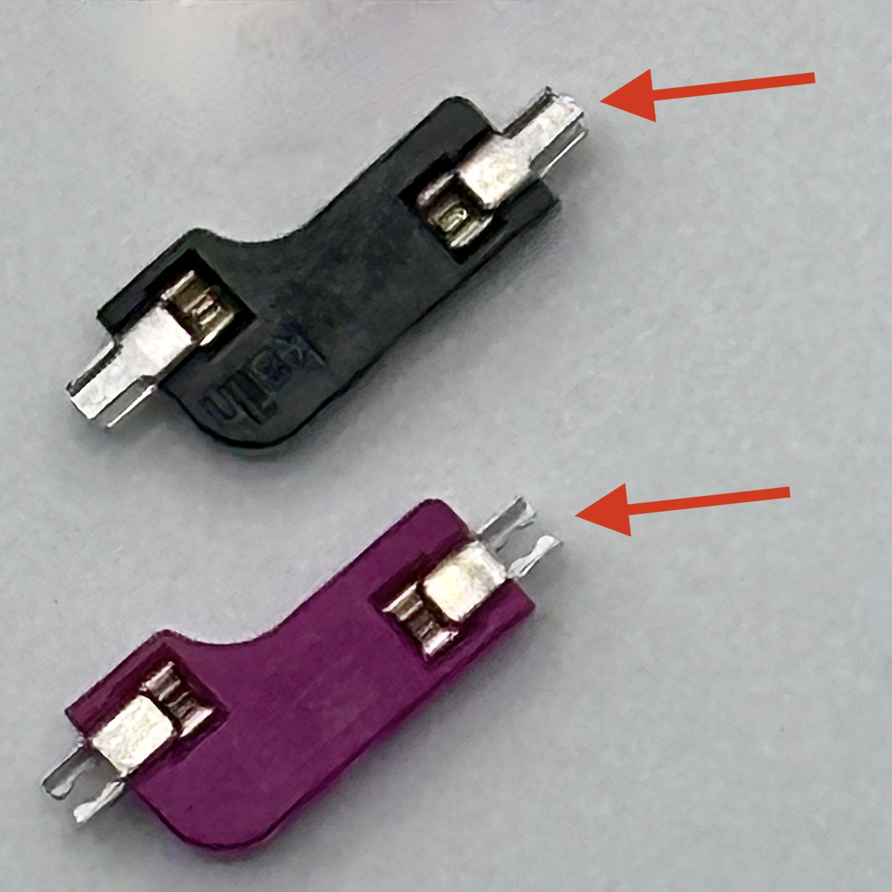 |
| Diodes | 103 | Surface mount SOD-123 1N4148, or through-hole 1N4148 diode. These are common, any old one should do. Through hole is usually easier to solder. | SMD:    [AliExpress](https://www.aliexpress.us/item/2251832663565152.html)   [JLCPCB](https://jlcpcb.com/partdetail/3368026-1N4148SOD123/C2972760)   Through-hole: [AliExpress](https://www.aliexpress.us/item/2251832473773777.html)   [Amazon](https://www.amazon.com/100-Pieces-1N4148-Switching-High-Speed/dp/B079KJ91JZ) |  |
| Raspberry Pi Zero | 2 | There's tons of clones available. Getting the version with the header pins pre-soldered saves you some time, but the pins are long so you'll have to nip off the excess and the pins may bend during shipping. Consider getting the versions without the soldered pins, and using [low profile header pins](#optional---low-profile-header-pins) instead of the header pins it comes with. | [Amazon](https://www.amazon.com/RP2040-Zero-High-Performance-Microcontroller-Castellated-Boards-2pcs/dp/B0B2Z3YWB9/)   [AliExpress](https://www.aliexpress.us/item/3256805808673201.html) |  
| TRRS Jacks | 2 | PJ-320A | [AliExpress](https://www.aliexpress.us/item/2255800474897706.html) |   |
| TRRS or TRS (3.5mm "Headphone" Cable) | 1 | Either TRRS "4 pole" or TRS "3 pole" will work. These are often referred to as 3.5mm audio cables, or 'aux' cables.  | [Aliexpress](https://www.aliexpress.us/item/3256804197001011.html)   [Amazon](https://www.amazon.com/gp/product/B072TYSV61)|   | 
| MX Style Switches or Choc V1 low profile switches. | 101 | For MX switches, 3-pin or 5-pin will work. For the Choc low profile switches, only V1 is supported.| |
| Key Caps | 101 | Look for keycap sets for "[100% full size](https://thegamingsetup.com/wp-content/uploads/Keyboard-Size-Guide-The-Gaming-Setup-scaled.webp)" keyboards.     **Choc V1 Switches**: Choc Switches don't have many keycap options available.     **MX swtiches**: The ErgoDonk Zero was designed with the SA [keycap profile](https://www.reddit.com/media?url=https%3A%2F%2Fi.redd.it%2Fkld2wynulsq51.png) in mind. The default switch layout on the PCB makes use of the different SA row heights. If you intend to move the keys about, XDA profile is recommended.  | [Choc V1 AliExpress](https://www.aliexpress.us/item/2251832794671800.html)   [MX 'SA' AliExpress](https://www.aliexpress.us/item/3256805853319024.html)   [MX SA Amazon](https://www.amazon.com/Ducky-Doubleshot-Keyboards-Compatible-Standard/dp/B08WXBVQ4W/?th=1)   [MX XDA AliExpress](https://www.aliexpress.us/w/wholesale-xda-keycaps.html)|
| Rotary Encoders and Caps | 2 | EC-11 Rotary Encoder. 20mm stem is the most common, and a 6mm shaft is standard. Either "D" shaft or round shaft will work. If you're partial to fancy knobs, you should pick a shaft that matches your knob. 6mm shafts are used for guitar knobs, so you've got plenty of options. SA Profile keycaps can be quite tall, so you may want to use tall knobs as well. Some EC11's include a washer and nut, but you won't be using either the washer or nut. | [Amazon](https://www.amazon.com/gp/product/B07D3DF8TK)   [AliExpress 20mm](https://www.aliexpress.us/item/3256802171959870.html) |   |
| M2 8mm FF spacers @todo - these heights & qty are outdated. | 12 | Connects the bottom plate to the key plate, running through the PCB | |
| M2 12mm FF spacers | 6 | Connects the bottom plate to the OLED plate, running through the PCB and the keyplate. @todo - is it really 12mm? | |
| M2x4mm screws | 18 | M2 screws. | |
| Case | 1 Left Set, 1 Right Set | Case files are located in the [case folder](./Case). | @todo - regenerate after next prototype validated |
| USB-C Cable | 1 | USB cable for connecting the keyboard to your computer. | | 

### Optional - PCB screw in Stabilizers 
Supports up to 8 PCB mounted screw in stabilizers that are 2u in length. Stabilizers often come in sets based on keyboard sizes. A full size 104 key set will usually have 7 2u bars. Note, "PCB mount stabilizers" are not the same as "plate mount stabilizers". 
@todo - add images.

### Optional - Solenoid
The solenoid attaches to the PCB below the left palm. It's lovely and loud. Will only work on the left hand.
Based on this [diagram by Adafruit](https://cdn-shop.adafruit.com/product-files/412/solenoid_driver.pdf). 
[QMK Docs for solenoid.](https://docs.qmk.fm/#/feature_haptic_feedback?id=solenoids) 
| Name | Count | Remarks | Potential Storefront |
| - | - |-|-|
| Solenoid | 1 | 4.5v Solenoid - the Amazon Uxcell solenoid is the most reliable one I've found. Some [3V Solenoids](https://www.aliexpress.us/item/3256802092636163.html) from AliExpress will work - but the 'thunk' is not nearly as satisfying. Go with the 4.5v if you can. | [Amazon](https://www.amazon.com/dp/B013DR655A)  [AliExpress](https://www.aliexpress.us/item/3256805711149774.html)
 1k Resistor | 1 |   A 2.2k resistor should work as well, but I've not tried it.| [Amazon](https://www.amazon.com/gp/product/B08FHPKF9V) [Aliexpress](https://www.aliexpress.us/item/3256805483572082.html) |
 1N4001 Diode | 1 |  | [Amazon](https://www.amazon.com/gp/product/B079JPMW9H), [AliExpress](https://www.aliexpress.us/item/3256802685977811.html)|
 TIP 120 | 1 | Heatsinks are available for these, but aren't needed.  | [Amazon](https://www.amazon.com/gp/product/B083TQN12B/), [Aliexpress](https://www.aliexpress.us/item/3256803429634601.html) | 
 | M2 4mm screws | 2 | Attaches the Solenoid to the PCB | @todo use the same source as case screws in teh required section. |

### Optional - Case plates
 - Key plates are strongly recommended with 3-pin MX switches, but not technically required. The thumb keys tend to fall out if you don't use a key plate. If you're using choc switches or 5-pin MX switches, they stay put well enough to skip the key plate entirely. Key plates should be made from PCB or 3d printed. Acrylic is not recommended becasue the ErgoDonk is so large the acrylic can flex, making it difficult to seat the keys properly. 3d printable keyplates can be found [here]((https://www.printables.com/model/738066-ergodonk-zero-open-back-case)).
 - Bottom plates pair nicely with key plates and can be connected with M2 standoff posts. These are not strictly necessary, as you could use [adhesive rubber bumpers](https://www.amazon.com/gp/product/B074C2XKXH) on the underside of the pcb instead. Acrylic, PCB or 3d prints are good for these.
 - The MCU's and the Solenoid are taller than the key plate, so they have their own separate taller plataes cover plates. Acrylic, PCB or 3d prints are good for these.
 - The left MCU cover plate is different from the right MCU cover plate, because the left MCU cover plate also hides empty keyholes. 
 @todo add images here.
 - Spacers are intended to pass through the main pcb and screw onto the bottom plates, key plates, and MCU cover plates.

### Optional - 3d printed case
This [3d printable ErgoDonk Zero case](https://www.printables.com/model/738066-ergodonk-zero-open-back-case) includes a key plate and a "monobody" case that covers the front of the board and screws onto the back. The Solenoid acoustics on this case are not great. YMMV. 
 
  

### Optional - low profile header pins
- The header pins that come with the Zero are usually too long. You can either clip them off after soldering, or use [8.5mm low profile header pins ](https://www.aliexpress.us/item/3256805874707460.html) instead.

## Tools and materials

- soldering iron and solder
- no-clean flux makes soldering easier
- solder wick or desoldering pump to correct mistakes
- good tweezers
- flush cutters to trim diode legs
- masking, kapton or electrical tape
- isopropyl-alcohol for cleaning
- Optional - magnetic 'third hand' PCB work holding fixture. (I'm partial to the little cones) 
- Optional - multimeter for troubleshooting. 
- Optional - [magnifier headband](https://www.amazon.com/Headband-Magnifier-eSynic-Rechargeable-Detachable/dp/B08W55R47Z).

## Build Guide / Assembly steps
This guide includes all optional components. 

There's a few common soldering methods used with through-hole components. In this guide, we'll be using the third method - "work holding". Accordingly, the docs will not reference flipping the PCB over for soldering legs.

1. **The bendy method**: Push the legs through the holes, then bend the legs slightly outward on the bottom side to keep the component in the hole when the PCB is flipped over. Solder on the side of the board opposite from the side the component was inserted.
   
1. **The tape method**: Push the legs through the holes and put a piece of kapton tape over the component to keep it in place when the board is flipped. Solder on the side of the board opposite from the side the component was inserted.
   
1. **Work holding**: Use helping hands or work holding jig to keep the PCB lifted off the work surface. Insert components through the holes, _do not_ flip the pcb, and solder on the side the components are inserted.   This is the recommended method. If you have access to a 3d printer, you can print disposable [work holding legs designed specifically for the ErgoDonk Zero PCB](https://www.printables.com/model/733164-ergodonk-zero-pcb-holding-feet).    
**[Magnetic work holding thingies](https://www.aliexpress.us/item/2255800735314797.html)**      **[3d Printable work holding feet](https://www.printables.com/model/733164-ergodonk-zero-pcb-holding-feet)** 
  

### Prepare

Make sure you know which side you are working on, and don't make two left hand sides by mistake. Stick a piece of tape on the front side of both PCBs to help remember.
@todo Update image.

The assembly order does not matter. This guide is written in the order I like to install components, starting with the components on the back, shortest to tallest:
 - diodes
 - switch sockets

Then install the components on the front:
 - Jumpers
 - RP2040 Zero MCU
 - TRRS connector
 - Solenoid components
 - Rotary encoder

### Diodes

Diodes, surface mount or through-hole, should be installed on the back of the board. This allows for easy access after the keyplate is installed, and allows for the use of choc keyplates and stabilizers.

If you are hand soldering, through hole diodes are recommended because they are easier. If you damage a pad on one side, you can install the diode on the opposite side.

If you are using PCBA with surface mount diodes, either the front or the back will technically work, but surface mount diodes on the front will prevent the use of a choc keyplate.

There is one diode per key, and one for the rotary encoder. The right hand has more than the left hand.

When inserting diodes into the backs of the boards, you only need to insert diodes into the footprints that have an accompanying switch socket outline. For example, in this image, we are looking at the backside of the left hand board. The left hand does not have a switch 18, so there is no socket outline, and so no diode would be needed. If you do add a diode where it is not needed, there is no negative impact. 
 

For surface mount diodes, a common soldering method method is to tin one pad, place the diode on, apply the soldering iron to the diode leg until it melts the solder underneath and sinks flush with the PCB. Then come back and solder the other leg. Alternately, you can use a rework station heat gun and solder paste. (I prefer this method for smds).
 SMD Orientation: 

For through-hole diodes, pre bending the legs while they are still on the paper strip makes inserting them much easier. You can use a 3d printed diode [bending jig](https://www.printables.com/model/734696-diode-bending-jig-8mm) to make quick uniform bends.  

Alternately, a carpenters pencil is roughly the right size. (The diode holes are 8mm apart, wooden pencils are often 7mm - 8mm).

With the PCB eleveated via workholding, insert the bent diodes into the holes on the back of the board. 
Diodes _must_ be oriented with the black band in the direction of the "arrow" symbol on the PCB. There is also a black outline around the pad to make it easy to check the diode orientation is correct after the diode has been soldered in place. 

 
  

Solder the legs in place.

Flip over the board, and trim the legs.

When you trim off the diode legs, save 12 for use as jumpers.

### Switch Sockets
Switch sockets installed on the back of the PCB facing up towards the front of the PCB. Make sure they are flush with the PCB. 

1. Put all the sockets in place. PCB hole tolerance can vary quite a bit, so some sockets may snap in, while others rest in the holes. If you have some that snap in, be sure to check everything is flush before you start soldering. 
1. Solder _one_ side of each socket by heating the metal connector. Apply solder and look for the solder to wick down to the PCB. You want a solid joint since this may take some mechanical strain from switch installation and removal. The 3d printed workholding feet are really handy here. You can reposition the board as you work to get the best angle for soldering those connectors.
1. Give the board a few good taps to make sure there are no loose sockets.
1. Rotate the board 180 degrees and solder the remaining sides.

 

### Jumpers
Because the MCU on both sides shares the same footprint, we need to set jumpers to ensure the power is routed correctly. The set of six jumpers for the right and left hands are marked accordingly. They can be soldered on the front or the back. Soldering on the front is recommended.

You can bridge the jumpers by dragging a blob of solder across the 2 adjacent pads. Modern rosin core solder can make this difficult. As an alternate bridging method, you can bend a diode leg and solder that in place. There is bending jig to make it easy to bend jumpers to the optimal width. The bottom slot on the jig is for the jumpers.

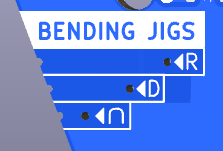 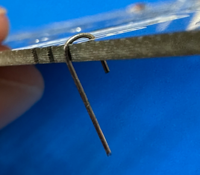 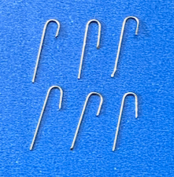 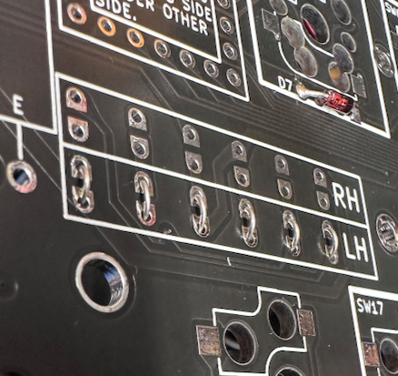  

### RP2040 Zero MCU
The Zero is installed on the top of the board, buttons facing up.

 
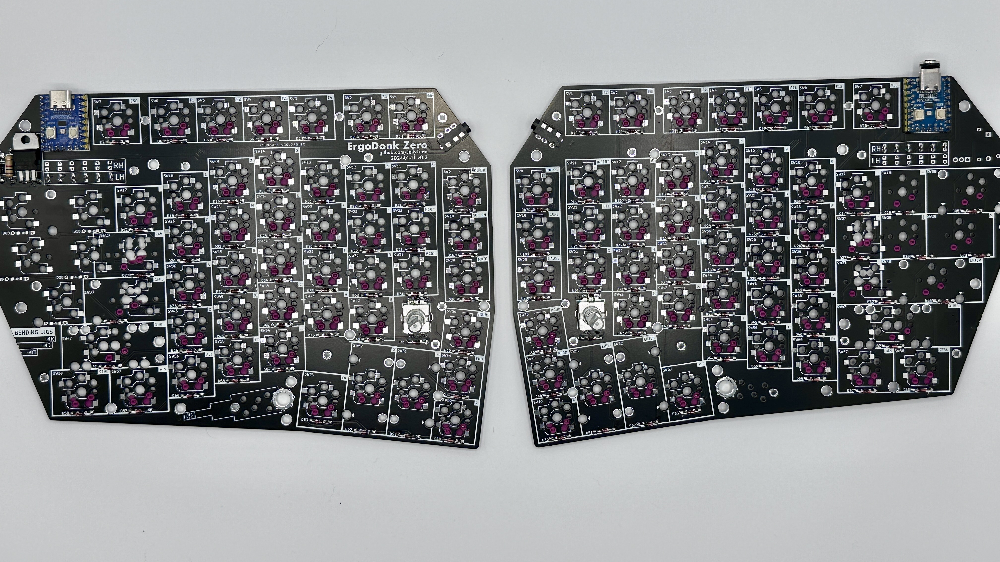

* Top of the board: this is the side of the PCB opposite the diodes and switch sockets
* Marked holes: Insert the Zero into the holes with the rectangular outline on the top of the board. 

Install the Zero using the male-male headers that came with the Zero. (Or the low-profile headers, if your feeling fancy)!
1. Insert the headers into the board and the Zero both before soldering. The header pin rows can tilt a little if it's not inserted into both the board and the Zero. The header pins that come with the zero have one longer side. Install the longer side on the PCB because you'll need to trim these, and the trimmed pins look better on the underside of the board. Use a piece of kapton tape to attach the Zero to the PCB while soldering.
If you are using a Zero with pre-soldered headers, you'll likely have to bend the headers a bit to get everything to line up perfectly. Once you get it in, the friction will keep it in place, and you can skip the tape.

1. Flip the board over. Solder 1 of the outermost pins on each pin header on the PCB. Hold the board up to make sure the pin header is sitting flush with the pcb. If it's not, you can reheat that joint until it is flush.  
1. Solder the remaining pcb/pin header joints on the back.
1. Flip the board over. With the Zero, repeat the process of soldering & checking 1 pin with the pin header and the Zero. 
1. Solder all the remaining Zero/pin header pins. 

### TRRS Jacks
Insert the jack into the outline on the front of the board. Some brands of jack will snap into the board, holding them in place. Others may need to be taped down. Then flip the board over and solder on the backside. Solder 1 pin first to check that everything is flush. Adjust as needed. Solder remaining pins. 
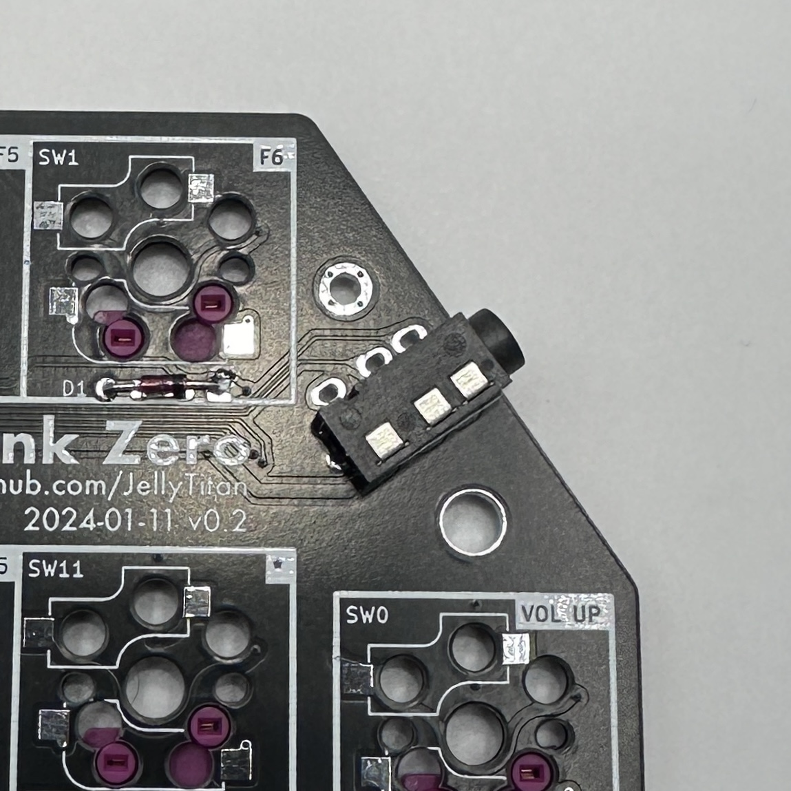 

### Solenoid
The Solenoid is installed on the left hand front of the board _only_. Right hand installation is not supported.

1. Put a piece of electrical tape on the backside of the tip120 and trim it to the outline. In some applications these get really hot so a heat sink could be attached. Our application will never need that heat sink, but we don’t want that exposed metal against our board. Alternately, You can slap a sticker on there if you’re feeling fancy.   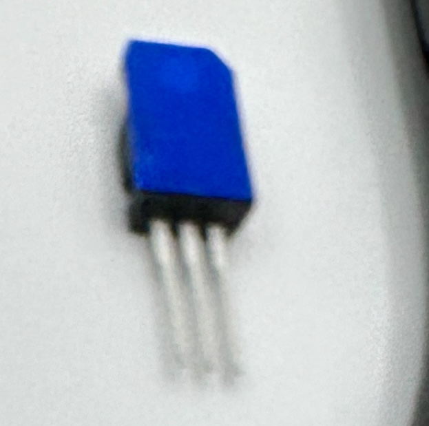  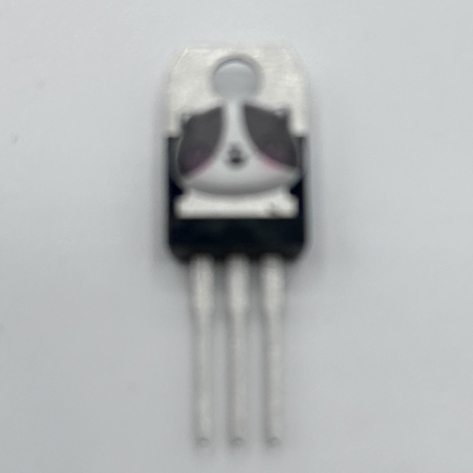
1. Use the tip120 bending jig to get a 90 degree bend just below the fat part of the pins.
   
1. Insert the tip120 into the holes on the front of the board. Solder 1 pin, verify the tip120 is straight before soldering the remaining pins.  
1. Bend the legs of the 1k resistor using the bending jig on the left of the board. 
1. Insert the 1k resistor into the holes on the front of the board. Orientation of the resistor does not matter. Solder in place.  
1. Bend the legs of the 1N4004 Shottky diode using the bending jig on the left of the board. 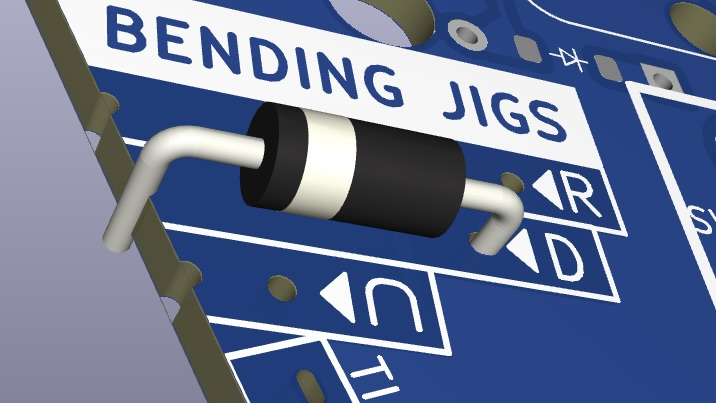
1. Insert the 1N4004 Shottky diode into the holes on the front of the board. Be sure to orient the diode with the strip towards the top of the board. Solder in place. 
1. Flip the board and trim the pins sticking out for the components you just installed.  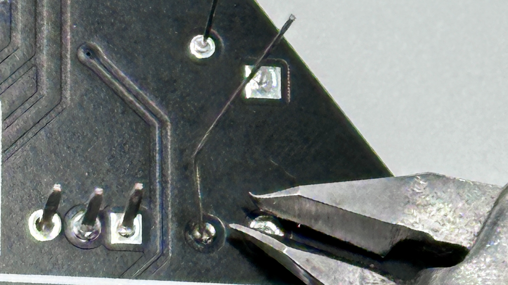
1. Using M2 screws, attach the solenoid to the top of the board. Run the wires through the big hole in the PCB. Tape the wires down with kapton tape. Solder onto the holes marked 'solenoid'. Polarity does not matter, so either wire can go in either hole. Versions after 0.2.1 have an additional solenoid footprint connetion point closer to the solenoid itself. This is to accomodate shorter wires. Either connection point will work.  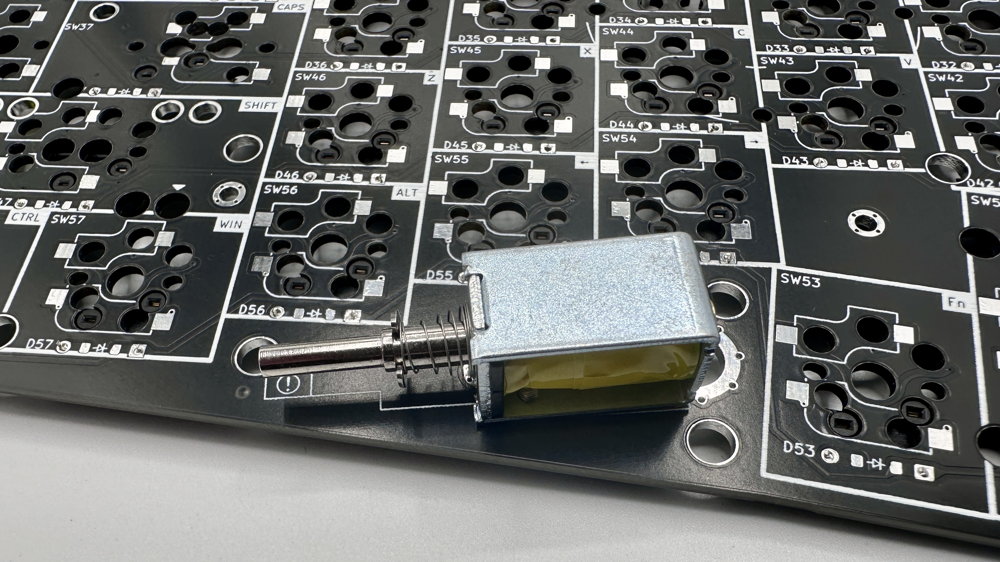 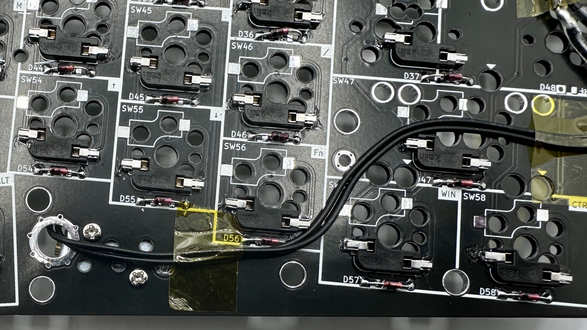 

### Rotary encoders
Saved these for last because they are tallest. Insert into the top of the board, and solder on the backside. Some EC11's have metal tabs on opposite sides that add mechanical stability - no need to solder those tabs.
 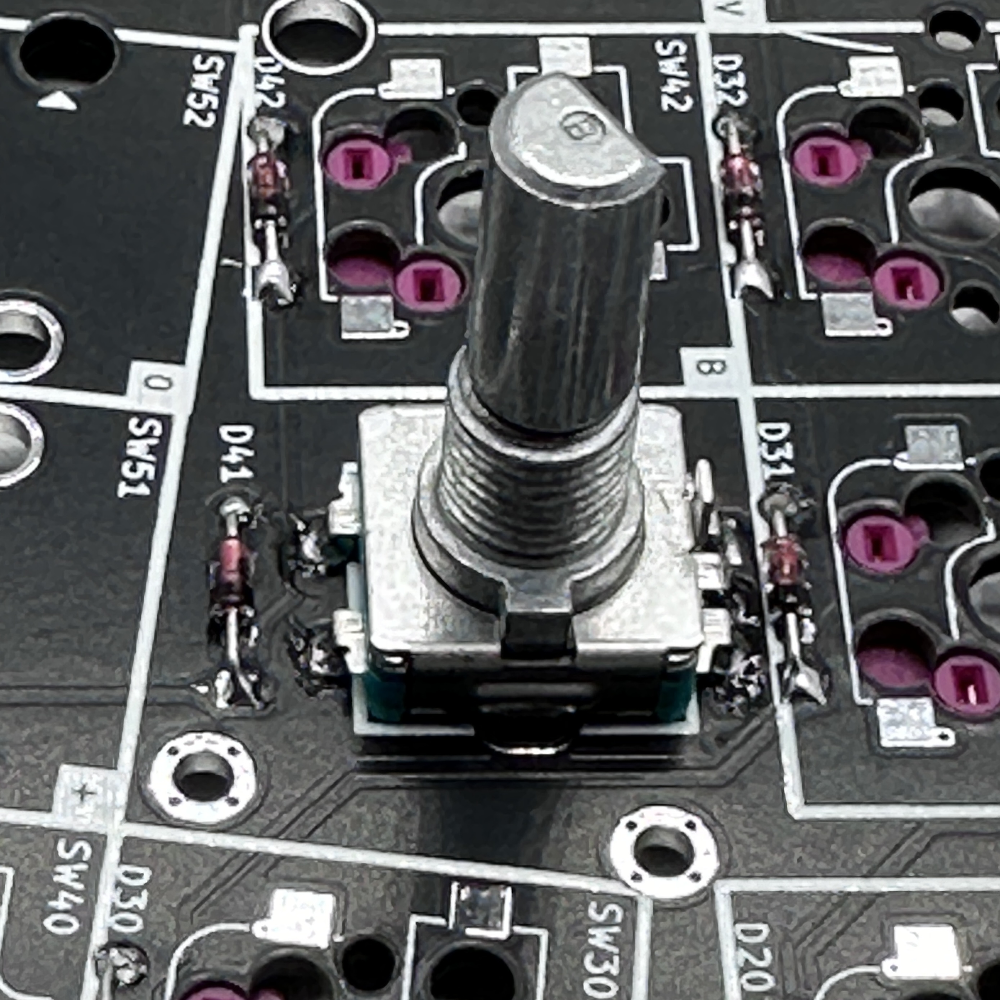

### Final assembly
Installing the stabilizers, keys and case.

1. Install stabilizers. (Optional) The stabilizers are inserted into the front of the board, and screws are inserted on the back of the board. There are an abundance of holes around the pinky keys, so the stabilizer insertion holes have been marked with an arrow on the front of the board. Lay down the stabilizer stickers starting with the arrow side.      Notice the thumb clusters stabilizers are 'back-to-back':  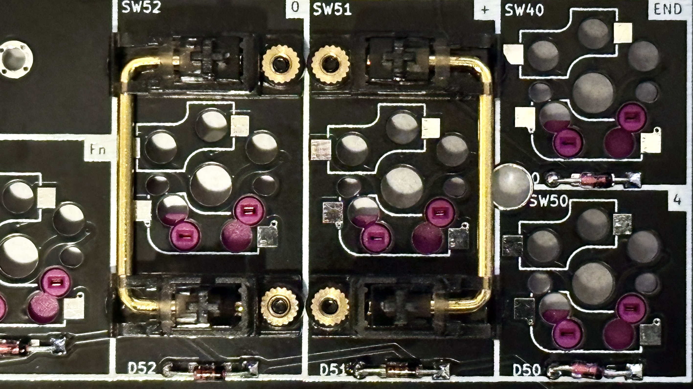
1. Snap switches into the corners of the key plate.
1. Place the PCB on a flat surface. This will save some strain on the solder joints in the next step (though they should be able handle it).
1. Carefully lower the top plate with switches on the main PCB and push into sockets. Ensure pins are aligned.
1. Snap the remaining switches into the top plate pressing into the sockets.
1. Place the encoder knob on the shaft. Tighten the set screw with a hex key. A small screwdriver for glasses may do in a pinch.
1. @todo - update: Slide the four 8mm standoffs through the PCB and align to the holes on the key plate. Attach the standoffs to the keyplate using M2 screws. 
1. Attach the bottom plate to the four standoffs installed in the previous step.
1. Use M2 screws to attach the three 12mm standoffs to the OLED cover plate.
1. Slide the three standoff on the OLED plate through the PCB. Attach those standoffs to the backplate using M2 screws.
1. Put at least 4 adhesive rubber feet in the corners so the keyboard is not moving when you type.

 

## Warnings and disclaimers
- Don't connect or disconnect the TRRS cable when the keyboard is powered. It may short out. Always disconnect the USB cable first.
- Be gentle with USB-C ports on your micro controllers. They are easy to break.
- Keep in mind that this is a prototype of a DIY keyboard. It’s not a polished product.

 

## Firmware and programming
The ErgoDonk Zero uses QMK's `ee_hands` to determine which hand is connected to USB. This requires that the first time the keyboard is flashed, each hand uses a different file. When the right hand is connected to USB, the solenoid will not work.

After the first 'drag and drop' flash, you can tweak your keymaps further using [VIA](https://www.caniusevia.com/). (Using VIA is covered in the [next section](#via)).

### The easy way
The rp2040 supports 'drag and drop' flashing with a UF2 file on Mac or PC. This is the recommended approach if you're not familiar with compiling QMK firmware yourself. After the first 'drag and drop' flash, you can tweak your key maps further using [VIA](https://www.caniusevia.com/).

To flash with 'drag 'n drop':
These instructions are a summarization of the [official explanation found in the QMK docs](https://docs.qmk.fm/#/flashing?id=raspberry-pi-rp2040-uf2).
1. Make sure halves are not connected together with TRS cable.
1. Connect one half to USB.
1. Enter the bootloader using any of the following methods. These are dependant on where your RP2040 Zero came from.
    * Hold down `BOOT` and tap `RESET`.
    * Hold the `BOOT` button while plugging in the usb cable.
    * Double tapping the `RESET` button on the RP2040. ([Double tap reset is enabled by default on the RP2040](https://github.com/qmk/qmk_firmware/blob/master/docs/platformdev_rp2040.md#double-tap-reset-boot-loader-entry-iddouble-tap)).
    * **Bootmagic reset** (works after you have flashed once): Hold down the top far corner key while plugging in the keyboard (`~` left half, `-` right half). This will also clear the EEPROM. @todo Add Bootmagic to QMK config.
1. Wait for the OS to detect the device.
1. Copy the .uf2 file to the new USB disk. 
  * The files can be found in this repo at [./Firmware/drag_and_drop](./Firmware/drag_and_drop)
  * There is a different file for right hand and left hand, as denoted by a `_RH` or `_LH` suffix. (@todo - can we use matrix detection to use a single file for both hands)?
  * On Mac after the file is dropped, the 'Keyboard setup assistant' may be triggered. You can ignore and quit the assistant.(@todo add relative path to UF2 files.) 
1. Unplug the side you just flashed, and repeat the process with the other side.
1. Disconnect both halves from USB.
1. Connect both halves together using the TRS cable. 
1. Connect the left half to USB.
1. Test everything using VIA. (Earlier versions of VIA were downloaded and installed. The latest version, VIA 3, is accessed through the web interface).

### The less easy way
If you want to build your own firmware, ErgoDonk Zero uses [QMK Firmware][qmk_firmware]. Support is not in the main QMK repository [yet](@todo: Update this url with official PR). Instead use the [jellytitan/qmk_firmware](https://github.com/JellyTitan/qmk_firmware/tree/ergodonk_zero) fork and the `ergodonk_zero` branch.
https://docs.qmk.fm/#/flashing?id=raspberry-pi-rp2040-uf2

To flash:
- Clone [https://github.com/jellytitan/qmk_firmware](https://github.com/jellytitan/qmk_firmware)
- Switch to the `ergodonk_zero` branch with `git checkout ergodonk_zero`
- Make sure your QMK environment [is setup][qmkintro].
- Make sure halves are _not_ connected together with TRS cable.
- Connect one half to USB, flash the firmware (always follow the current instructions in the QMK documentation! The command might look something like this: `qmk flash -kb ergodonk_zero --keymap default -bl uf2-split-right` and `qmk flash -kb ergodonk_zero --keymap default -bl uf2-split-left`). Use the reset button to reset the keyboard when you are asked to in console. 
- Connect the second half and flash it in the same way as the previous one.
- Disconnect the USB cable. Connect both halves together with TRRS cable.
- Connect USB cable to the **left** side.
- Enjoy!

 

## VIA
Until the ErgoDonk Zero layout is merged into the official VIA repo, you'll need to load the VIA definition manually. ()
> [!IMPORTANT]
> Editing with VIA will only work after you've flashed the ErgoDonk Zero at least once.

1. Visit https://usevia.app/
1. Open the "Settings" tab by clicking on the gear icon at the top of the page. 
1. Enable "Show Design tab".  

1. Now you should see a paintbrush icon at the top of the screen. Click on that to open the "Design tab".
1. Download the ErgoDonk Zero via config file: [ergodonk_zero.json](https://raw.githubusercontent.com/JellyTitan/ErgoDonk-Zero/main/Firmware/via/ergodonk_zero.json). (Right click and 'Save As' to download the .json file). 
Once you have the file locally, Click "Load" to upload `ergodonk_zero.json`.  (The ErgoDonk Zero PR for VIA can't be submitted until the QMK PR is submitted and approved. That PR is waiting and ready to go: [VIA PR for ErgoDonk Zero](https://github.com/JellyTitan/via-keyboards/tree/ergodonk_zero)). 

1. After the definition is loaded, you may be asked to authorize a connection to your device. If the auth request doesn't pop-up automagically, click on the 'configure' icon at the top of the page, then click on 'Authorize Device +'  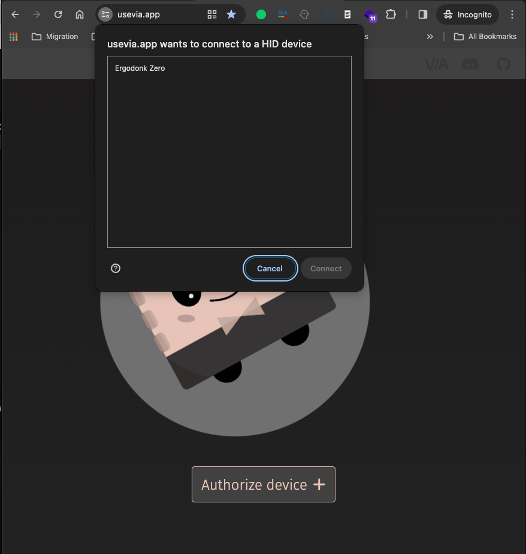
1. Clicking on the "Configure" tab will let you modify your layout. 

## Version History
See [build log](./BUILDLOG.md).

 

## Future feature wish list
Theres some features that I would like to add if time permits. Open to contributions.
* [ ] Plate mount stabilizers. Currently has PCB mount only, but would like to support both types.
* [ ] Write a PCBA ordering walk through. I pulled images for the process with the ErgoDonk Zero - but never wrote a guide.

 

## Links
- [QMK Firmware][qmk_firmware]
- [QMK Configurator][qmk_configurator]

## Default layout

## Images of keyboard
@todo update these after final hardware!!

