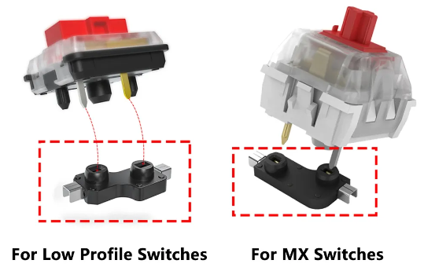
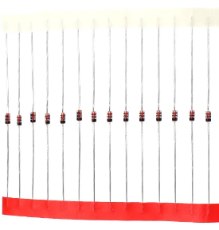
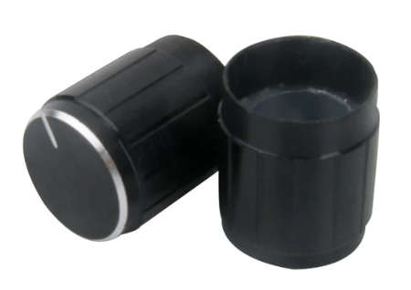
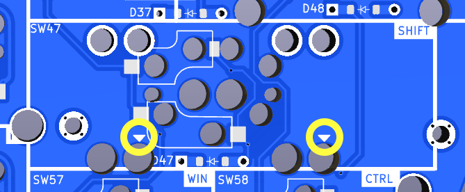

# ErgoDonk Zero Keyboard
## **THIS IS A WORK IN PROGRESS AND NOT PRODUCTION READY**
ErgoDonk Zero is a 6×9+6 keys split ortholinear keyboard with encoder & solenoid support, hotswap sockets for MX or Choc v1 low profile switches, and uses the RP2040 "Zero" MCU.

The ErgoDonk Zero was designed by [Ryan Neff](https://github.com/JellyTitan). Many of the footprints came from the well-regarded foostan [kbd library](https://github.com/foostan/kbd). 

[Overview](#overview)
 - [Design philosophy](#design-philosophy)

[Bill of Materials](#bill-of-materials)
 - [Required Parts](#required-parts)
 - [Optional - MCU Sockets](#optional---mcu-sockets)
 - [Optional - PCB screw in Stabilizers](#optional---pcb-screw-in-stabilizers)
 - [Optional - Solenoid](#optional---solenoid)
 - [Optional - key plates](#optional---key-plates)
 - [Optional - low profile header pins](#optional---low-profile-header-pins)
 - [Tools and materials](#tools-and-materials)

[Build Guide / Assembly steps](#build-guide--assembly-steps)
 - [Prepare](#prepare)
 - [Soldering](#soldering)
 - [Diodes](#diodes)
 - [Switch Sockets](#switch-sockets)
 - [Jumpers](#jumpers)
 - [Pi Zero MCU](#pi-zero-mcu)
 - [TRRS Jacks](#trrs-jacks)
 - [Rotary Encoders](#rotary-encoders)
 - [Final assembly](#final-assembly)
 - [Warnings and disclaimers](#warnings-and-disclaimers)
 - [Firmware and programming](#firmware-and-programming)

[Troubleshooting](#troubleshooting)
 - @todo crib this section from Junco?
 - [An entire row or column of keys is not working](#an-entire-row-or-column-of-keys-is-not-working)
 - [Random key or keys not working](#random-key-or-keys-not-working)

## Overview

## Design philosophy
The ErgoDonk Zero is designed with the following goals:
* Comfort
  * Ortholinear.
  * Split.
  * Tiltable. Has tenting puck mounting holes. [SplitKB](https://splitkb.com/products/tenting-puck) or 3d print your own: design by [
Bubbleology](https://www.printables.com/model/235433-tenting-puck-for-keyboard-tripod-mount/comments/943096).
* Accessible
  * Uses standard keycap sets.
  * Can use either MX or Choc V1 low profile key switches.
  * Through-hole components used for easy soldering.
  * "Drag and drop" MCU flashing.
  * [Supports more keys](http://www.keyboard-layout-editor.com/#/gists/ac776db3b0deef94de51943c384cfdfc) than a traditional split ergo, making it a good transition to a smaller split, or for those who really like their "F" keys.
* Low cost
  * The PCB is reversible to reduce manufacturing costs.
  * Uses RP2040 Zero. (Inexpensive clones are readily available through Alixpress for ~$3USD)
  * Does not require split-specific keycaps.

## Bill of materials
### Required Parts

| Name | Count | Remarks | Potential Storefront | Image |
| ---- | ----- | ------- | -------------------- | ----- |
| PCB | 2 | The PCB should be 1.6mm thick. I used JLCPCB's default settings only customizing the PCB color, and selecting 'lead free'. | Manufacturers such as JLCPCB, LCSC, and Elecrow. [Price comparison tool](https://pcbshopper.com/) |  |
| Hot-swap Sockets | 101 | The PCB requires sockets. Switches cannot be soldered directly to the board. Either MX or Choc low profile sockets| [Aliexpress](https://www.aliexpress.us/item/3256803687338432.html) |  |
| Diodes | 103 | Surface mount SOD-123 1N4148, or through-hole 1N4148 diode. These are common, any old one should do. Through hole is usually easier to solder. | SMD:    [AliExpress](https://www.aliexpress.us/item/2251832663565152.html)   [JLCPCB](https://jlcpcb.com/partdetail/3368026-1N4148SOD123/C2972760)   Through-hole: [AliExpress](https://www.aliexpress.us/item/2251832473773777.html)   [Amazon](https://www.amazon.com/100-Pieces-1N4148-Switching-High-Speed/dp/B079KJ91JZ) |  |
| Raspberry Pi Zero | 2 | There's tons of clones available. Getting the version with the header pins pre-soldered is nice, but they are long so you'll have to nip off the excess. | [AliExpress](https://www.aliexpress.us/w/wholesale-rp2040-zero.html) |  
| TRRS Jacks | 2 | PJ-320A | [AliExpress](https://www.aliexpress.us/item/2255800474897706.html) |   |
| TRRS or TRS (3.5mm "Headphone" Cable) | 1 | Either TRRS "4 pole" or TRS "3 pole" will work. These are often refered to as 3.5mm audio cables, or 'aux' cables.  | [Aliexpress](https://www.aliexpress.us/w/wholesale-3-5-mm-audio-cable.html)   [Amazon](https://www.amazon.com/s?k=short+aux+cable)|   | 
| MX Style Switches or Choc V1 low profile switches. | 101 | For MX switches, 3-pin or 5-pin will work. For the Choc low profile switches, only V1 is supported.| |
| Key Caps | 101 | Look for keycap sets for "[100% full size](https://thegamingsetup.com/wp-content/uploads/Keyboard-Size-Guide-The-Gaming-Setup-scaled.webp)" keyboards.     **Choc V1 Switches**: Choc Switches don't have many keycap options available.     **MX swtiches**: The ErgoDonk Zero was designed with the SA [keycap profile](https://www.reddit.com/media?url=https%3A%2F%2Fi.redd.it%2Fkld2wynulsq51.png) in mind. The default switch layout on the PCB makes use of the different SA row heights. If you intend to move the keys about, XDA profile is recommended.  | [Choc V1 AliExpress](https://www.aliexpress.us/item/2251832794671800.html)   [MX 'SA' AliExpress](https://www.aliexpress.us/item/3256805853319024.html)   [MX SA Amazon](https://www.amazon.com/Ducky-Doubleshot-Keyboards-Compatible-Standard/dp/B08WXBVQ4W/?th=1)   [MX XDA AliExpress](https://www.aliexpress.us/w/wholesale-xda-keycaps.html)|
| Rotary Encoders and Caps | 2 | EC-11 Rotary Encoder. 20mm stem is the most common, and a 6mm shaft is standard. Either "D" shaft or round shaft will work. If you're partial to fancy knobs, you should pick a shaft that matches your knob. 6mm shafts are used for guitar knobs, so you've got plenty of options. SA Profile keycaps can be quite tall, so you may want to use tall knobs as well. Some EC11's include a washer and nut, but you won't be using either the washer or nut. | [AliExpress 20mm](https://www.aliexpress.us/item/2261799870168498.html) |   |
| M2 8mm FF spacers @todo - these heights & qty are outdated. | 12 | Connects the bottom plate to the key plate, running through the PCB | |
| M2 12mm FF spacers | 6 | Connects the bottom plate to the OLED plate, running through the PCB and the keyplate. @todo - is it really 12mm? | |
| M2x4mm screws | 18 | M2 screws. | |
| Case | 1 Left Set, 1 Right Set | Case files are located in the [case folder](./Case). | @todo - regenerate after next prototype validated |
| USB-C Cable | 1 | USB cable for connecting the keyboard to your computer. | | 

### Optional - MCU Sockets
This is strictly a quality of life upgrade. The older ProMicro's were notorious for weak Micro USB jacks that could snap off. This is not needed with the RP2040 Zero which uses USB-C.
| Name | Count | Remarks | Potential Storefront |
| - | - |-|-|
2.54mm Round Female Pin Header | 4 sets of 20 | They commonly come in strips of 40. They don't always snap in half cleanly, so get extra | [Aliexpress](https://www.aliexpress.us/item/2251832729504304.html)
Needle pin male connectors | 80 | Diode legs would also work, but these little sets of 4 are nice to work with. | [Aliexpress](https://www.aliexpress.us/item/2251832650595759.html?spm=a2g0o.order_list.order_list_main.186.15a91802YueygY&gatewayAdapt=glo2usa)

### Optional - PCB screw in Stabilizers 
Supports up to 8 PCB mounted screw in stabilizers that are 2u in length. Stabilizers often come in sets based on keyboard sizes. A full size 104 key set will usually have 7 2u bars. Note, "PCB mount stabilizers" are not the same as "plate mount stabilizers". 
@todo - add images.

### Optional - Solenoid
The solenoid attaches to the PCB below the left palm. It's lovely and loud. Will only work on the left hand.
Based on this [diagram by Adafruit](https://cdn-shop.adafruit.com/product-files/412/solenoid_driver.pdf). 
[QMK Docs for solenoid.](https://docs.qmk.fm/#/feature_haptic_feedback?id=solenoids) 
| Name | Count | Remarks | Potential Storefront |
| - | - |-|-|
| Solenoid | 1 | 4.5v Solenoid - the Amazon Uxcell solenoid is the most reliable one I've found. Some [3V Solenoids](https://www.aliexpress.us/item/3256802092636163.html) from Aliexpress will work - but the 'thunk' is not nearly as satisfying. Go with the Uxcell if you can. | [Amazon](https://www.amazon.com/dp/B013DR655A)
 1k Resistor | 1 |   A 2.2k resistor should work as well, but I've not tried it.| [Amazon](https://www.amazon.com/gp/product/B08FHPKF9V), [Aliexpress](https://www.aliexpress.us/item/3256805483572082.html) |
 1N4001 Diode | 1 |  | [Amazon](https://www.amazon.com/gp/product/B079JPMW9H), [AliExpress](https://www.aliexpress.us/item/3256802685977811.html)|
 TIP 120 | 1 | Heatsinks are available for these, but aren't needed.  | [Amazon](https://www.amazon.com/gp/product/B083TQN12B/), [Aliexpress](https://www.aliexpress.us/item/3256803429634601.html)

### Optional - key plates, bottom plates, and cover plates:
 - Key plates are strongly recommended with 3-pin MX switches, but not technically required. (The thumb keys tend to fall out if you don't use a key plate). If you're using choc switches or 5-pin MX switches, they stay put well enough to skip the key plate entirely.
 - Bottom plates pair nicely with key plates, and can be connected with M2 standoff posts. These are not strictly necessary, as you could use [adhesive rubber bumpers](https://www.amazon.com/gp/product/B074C2XKXH) on the underside of the pcb instead.
 - The MCU's and the Solenoid are taller than the key plate, so they have their own separate taller plataes cover plates.
 - The left MCU cover plate is different from the right MCU cover plate, because the left MCU cover plate also hides empty keyholes.
 @todo add images here.
 - Spacers are intended to pass through the main pcb and screw onto the bottom plates, key plates, and MCU cover plates.

### Optional - low profile header pins
- The header pins that come with the Zero are usually too long. You can either clip them off after soldering, or use [8.5mm low profile header pins ](https://www.aliexpress.us/item/3256805874707460.html) instead. 

## Tools and materials

- soldering iron and solder
- no-clean flux makes soldering easier
- solder wick or desoldering pump to correct mistakes
- good tweezers
- flush cutters to trim diode legs
- masking, kapton or electrical tape
- isopropyl-alcohol for cleaning
- multimeter for troubleshooting

## Build Guide / Assembly steps
This guide includes all optional components.
### Prepare

Make sure you know which side you are working on, and don't make two left hand sides by mistake. Stick a piece of tape on the front side of both PCBs to help remember.
@todo Update image.

The assembly order does not matter. This guide is written in the order I like to install components, starting with the components on the back, shortest to tallest:
 - diodes
 - switch sockets

Then install the components on the front:
 - Jumpers
 - RP2040 Zero MCU & socket
 - TRRS connector
 - Solenoid components
 - Rotary encoder

### Diodes
@todo update image

Diodes, surface mount or through-hole, can be installed on either the front or the back. Back side installation is recommended because after the case plates are installed, it's easier to access the back then the front. 

If you are hand soldering, through hole diodes are recommended because they are easier. If you damage a pad on one side, feel free to move that diode to the other side.

Diodes _must_ be oriented with the white band in the direction of the "arrow" symbol on the PCB.
@todo add image.

For surface mount diodes, a common method is to tin one pad, place the diode on, apply the soldering iron to the diode leg until it melts the solder underneath and sinks flush with the PCB. Then come back and solder the other leg. Alternately, you can use a rework station heat gun and solder paste. (I prefer this method for smds).
.
This board has been designed with automated Printed Circuit Board Assembly (PCBA) in mind. Since the minimum PCB order quantity is usually 5, it's often worth ordering PCBA for the diodes alone. (Roughly 1030 solder joints).
@todo port the PCBA guide you wrote for the Junco.

There is 1 diode per key, and 1 diode on the rotary encoder.
@todo add image.

### Switch Sockets
Switch sockets installed on the back of the PCB facing up towards the front of the PCB. Make sure they are flush with the PCB. 

Heat the metal connector, apply solder and look for the solder to wick down to the PCB. You want a solid joint since this may take some mechanical strain from switch installation and removal. 

I like to put all the sockets in, find a comfortable position, solder one side of each socket, then rotate the board 180 and solder the remaining sides.

### Jumpers
Because the MCU on both sides shares the same footprint, we need to set jumpers to ensure the power is routed correctly. The set of six jumpers for the right and left hands are marked accordingly. They can be soldered on the front or the back, for the sake of consistency, we'll go with the front. 

You can bridge the jumpers by dragging a blob of solder across the 2 adjacent pads. Modern rosin core solder can make this difficult. As an alternate bridging method, you can bend a diode leg and solder that in place. There is a diode 'jumper jig' adjacent to the jumper rows to make it easy to bend to the optimal width. 

@todo Add images.

### RP2040 Zero MCU
The Zero is installed on the top of the board, buttons facing up.
@todo-add image.
* Top of the board: this is the side of the PCB opposite the diodes, LEDs and switch sockets
* Marked holes: Insert the Zero into the holes with the rectangular outline on the top of the board. 

#### Pi Zero MCU installed permanently with header pins
You can permanently install the Zero using the male-male headers that came with the Zero. (Or the low-profile headers, if your feeling fancy)!
1. Insert the headers into the board and the Zero both before soldering. (The header pin rows can tilt a little if it's not inserted into both the board and the Zero.) The header pins may have one longer side. Install the longer side on the PCB, because you'll need to trim these, and the trimmed pins look better on the underside of the board. Use a piece of kapton tape to attach the Zero to the PCB while soldering.

1. Flip the board over. Solder 1 of the outermost pins on each pin header on the PCB. Hold the board up to make sure the pin header is sitting flush with the pcb. If it's not, you can reheat that joint until it is flush. 
@todo add images

1. Solder the remaining pcb/pin header joints on the back.
1. Flip the board over. With the Zero, repeat the process of soldering & checking 1 pin with the pin header and the Zero. 
1. Solder all the remaining Zero/pin header pins.
#### Pi Zero MCU installed with sockets
The needle pins will add some height to your MCU, so you'll need to use longer spacers later when installing the MCU cover plate.

You can use diode legs if you're feeling fancy.
To install a socketed Zero using the diode leg approach [from splitkb.com][promicrosocketing]:

1. Insert the needle pins into the female sockets, and then insert the female sockets into the PCB and the Zero. Assembling the sockets/Zero/PCB before soldering ensures an excellent alignment. Be sure that the Zero is face up, and that the socket pins are inserted into the square outline on the front of the board. Applying a piece of kapton tape to hold everything in place can be helpful. 

1. Flip the board over. On the back of the PCB, solder one pin on each side, pushing down on the PCB to ensure the headers are perpendicular and fully seated. Pick up the board and inspect to insure that everything is seated flush. If it's not flush, reheat the joint and push the socket down until it's flush. (Be sure you're not touching the pin your heating when you push it down).

1. Solder the remaining pins on the back of the pcb.

1. Flip over the board. On the front, solder 1 pin on each side to the Zero. Again check that everything is flush before soldering the remaining pins.

If you ever need to remove the Zero: do it by gently prying the board up in small increments, working your way around the board. Avoid pressure on the USB connector. The diode legs are quite weak and will usually bend if you pull the Zero off in one action.

### TRRS Jacks
Solder these on the front of the boards, inserting into the outline.
Some brands of jack will snap into the board, holding them in place while you solder. Other brands may require tape. Solder 1 pin first to check that everything is flush. Adjust as needed. Solder remaining pins. 

### Rotary encoders
Saved these for last because they are tallest. Insert into the top of the board, and solder on the backside. Some EC11's have metal tabs on opposite sides that add mechanical stability - no need to solder those.

### Final assembly
Installing the keys and case.
1. Optional: Screw stabalizers into PCB. The stabilizers are inserted into the front of the board, and screws are inserted on the back of the board. There are an abundance of holes around the pinky keys, so the stabalizer insertion holes have been marked with an arrow on the front of the board. 
 

@todo add image of inserted stabalizer for sw47.
1. Snap a few switches into the top plate, the corner switches work best.
1. Place the PCB on a flat surface. This will save some strain on the solder joints in the next step (though they should be able handle it).
1. Carefully lower the top plate with switches on the main PCB and push into sockets. Ensure pins are aligned.
1. Snap the remaining switches into the top plate pressing into the sockets.
1. Place the encoder knob on the shaft. Tighten the set screw with a hex key. A small screwdriver for glasses may do in a pinch.
1. @todo - update: Slide the four 8mm standoffs through the PCB and align to the holes on the key plate. Attach the standoffs to the keyplate using M2 screws. 
1. Attach the bottom plate to the four standoffs installed in the previous step.
1. Use M2 screws to attach the three 12mm standoffs to the OLED cover plate.
1. Slide the three standoff on the OLED plate through the PCB. Attach those standoffs to the backplate using M2 screws.
1. Put at least 4 adhesive rubber feet in the corners so the keyboard is not moving when you type.

## Warnings and disclaimers
- Don't connect or disconnect the TRRS cable when the keyboard is powered. It may short out. Always disconnect the USB cable first.
- Be gentle with USB-C ports on your microcontrollers. They are easy to break.
- Keep in mind that this is a prototype of a DIY keyboard. It’s not a polished product.

## Firmware and programming
@todo - update hte firmware.
### The easy way
The rp2040 supports 'drag and drop' flashing with a UF2 file on Mac or PC. This is the recommended approach if you're not familiar with compiling QMK firmware yourself. After the first 'drag and drop' flash, you can tweak your keymaps further using [VIA](https://www.caniusevia.com/).

VIA allows you to quickly change your keymap without flashing or a QMK build environment. I highly recommend it for experimenting. There are few downsides:
- it doesn't support custom logic like a key for switching between Mac/Win
- the exporting/importing keymaps has some problems with some multi-chord keys though typically I don't find I need to export/import
- lighting configuration keys only seem to affect lighting on the master side. If you don't change lighting much, a workaround is to plug just the right side in to the computer, change the lighting then plug everything back normally

To flash with 'drag 'n drop':
These instructions are a summarization of the [official explanation found in the QMK docs](https://docs.qmk.fm/#/flashing?id=raspberry-pi-rp2040-uf2).
1. Make sure halves are not connected together with TRRS cable.
1. Connect one half to USB.
1. Enter the bootloader using any of the following methods. These are dependant on where your RP2040 came from. You may have to remove an OLED to access the `BOOT` button.
    * Hold down `BOOT` and tap `RESET`.
    * Hold the `BOOT` button while pluging in the usb cable.
    * Double tapping the `RESET` button on the RP2040. ([Double tap reset is enabled by default on the RP2040](https://github.com/qmk/qmk_firmware/blob/master/docs/platformdev_rp2040.md#double-tap-reset-boot-loader-entry-iddouble-tap)).
    * **Bootmagic reset** (works after you have flashed once): Hold down the top far corner key while plugging in the keyboard (`~` left half, `-` right half). This will also clear the EEPROM.
1. Wait for the OS to detect the device.
1. Copy the .uf2 file to the new USB disk. 
  * The files can be found in this repo at ./Sofle_Zero/Firmware
  * There is a different file for right hand and left hand, as denoted by a `_RH` or `_LH` suffix. (@todo - can we use matrix detection to use a single file for both hands)?
  * On Mac after the file is dropped, the 'Keyboard setup assistant' may be triggered. You can ignore and quit the assistant.(@todo add relative path to UF2 files.) 
1. Unplug the side you just flashed, and repeat the process with the other side.
1. Disconnect both halves from USB.
1. Connect both halves together using the TRRS cable. 
1. Connect the left half to USB.
1. Test everything using VIA. (After you've downloaded and installed the VIA app from https://caniusevia.com/, it should recognize the keyboard when it opens).

### The less easy way
If you want to build your own firmware, ErgoDonk Zero uses [QMK Firmware][qmk_firmware]. Support is not in the main QMK repository [yet](@todo: Update this url with official PR). Instead use the [jellytitan/qmk_firmware](https://github.com/jellytitan/qmk_firmware) fork.
https://docs.qmk.fm/#/flashing?id=raspberry-pi-rp2040-uf2

To flash:
- Clone [https://github.com/jellytitan/qmk_firmware](https://github.com/jellytitan/qmk_firmware)
- Switch to the `sofle_Zero` branch with `git checkout sofle_Zero`
- Make sure your QMK environment [is setup][qmkintro].
- Make sure halves are not connected together with TRRS cable.
- Connect one half to USB, flash the firmware (always follow the current instructions in the QMK documentation! The command might look something like this: `qmk flash -kb sofle_choc -km default`). Use the reset button to reset the keyboard when you are asked to in console. 
- Connect the second half and flash it in the same way as the previous one.
- Disconnect the USB cable. Connect both halves together with TRRS cable.
- Connect USB cable to the **left** side.
- Enjoy!

 

## Links
- [QMK Firmware][qmk_firmware]
- [QMK Configurator][qmk_configurator]

## Default layout

## Images of keyboard
@todo update these after final hardware!!

## Version History
See [build log](./BUILDLOG.md).

<mark>[🔼 Back to top](#sofle-Zero-keyboard)</mark>
