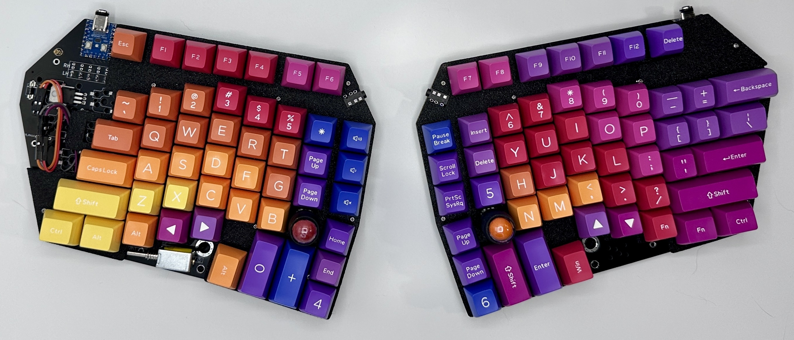

# ErgoDonk Zero Keyboard

ErgoDonk Zero is a 6×9+6 keys split ortholinear keyboard with encoder & solenoid support, hotswap sockets for MX or Choc v1 low profile switches, and uses the RP2040 "Zero" MCU.

The ErgoDonk Zero was designed by [Ryan Neff](https://github.com/JellyTitan). Many of the footprints came from the well-regarded foostan [kbd library](https://github.com/foostan/kbd). 

**The documentation is hosted on github pages at [ErgoDonk.com](ergodonk.com)**