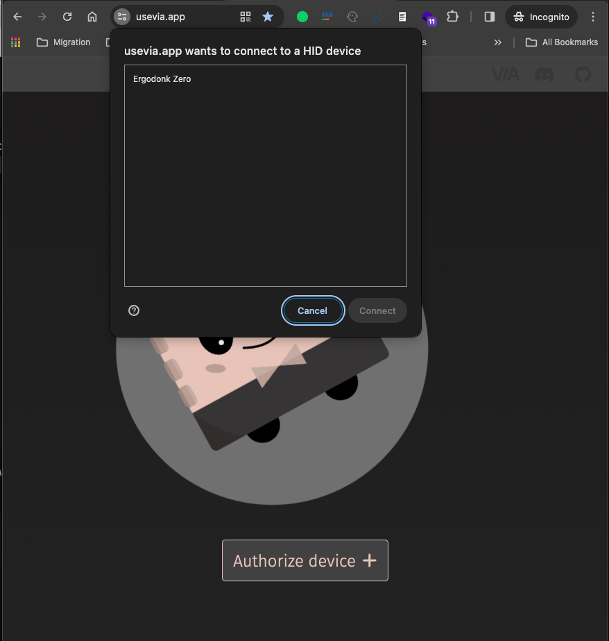
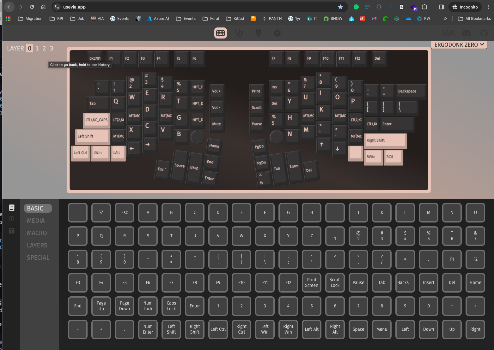

## VIA
Until the ErgoDonk Zero layout is merged into the official VIA repo, you'll need to load the VIA definition manually. ()
> [!IMPORTANT]
> Editing with VIA will only work after you've flashed the ErgoDonk Zero at least once.

1. Visit https://usevia.app/
1. Open the "Settings" tab by clicking on the gear icon at the top of the page. 
1. Enable "Show Design tab".  

1. Now you should see a paintbrush icon at the top of the screen. Click on that to open the "Design tab".
1. Download the ErgoDonk Zero via config file: [ergodonk_zero.json](https://raw.githubusercontent.com/JellyTitan/ErgoDonk-Zero/main/Firmware/via/ergodonk_zero.json). (Right click and 'Save As' to download the .json file). 
Once you have the file locally, Click "Load" to upload `ergodonk_zero.json`.  (The ErgoDonk Zero PR for VIA can't be submitted until the QMK PR is submitted and approved. That PR is waiting and ready to go: [VIA PR for ErgoDonk Zero](https://github.com/JellyTitan/via-keyboards/tree/ergodonk_zero)). 

1. After the definition is loaded, you may be asked to authorize a connection to your device. If the auth request doesn't pop-up automagically, click on the 'configure' icon at the top of the page, then click on 'Authorize Device +'  
1. Clicking on the "Configure" tab will let you modify your layout. 

