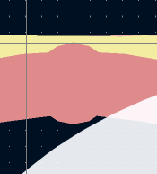
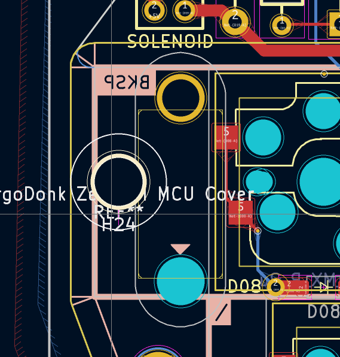
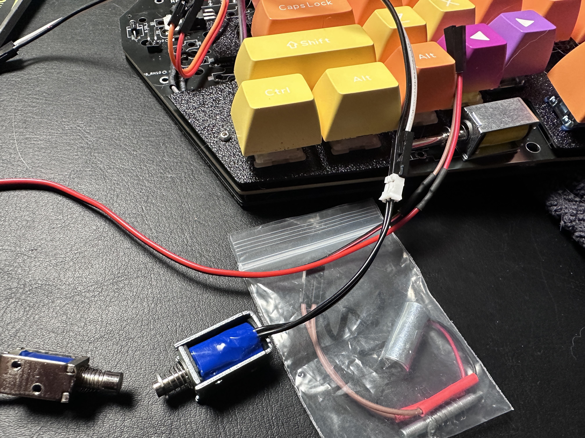

# Build log
These are mostly personal notes to keep track of things during the development process.

## v0.1
* 11-20-2023 Sent out v0.1 to JLC for production
* Split off from the main ErgoDonk development repo for easier cleanup/maintenance.

## v0.2
* Confirmed v0.1 works as expected.
* Put a GND plane on both sides, wire VCC directly. (with big fat traces)!
* Added jumper jig to help bend jumper bridges.
* Move all traces from pads to the corners to prevent acid traps.
* Fix jumper bay graphics
* Changing pad connections on Polygons to 'Solid' - might be a bit harder to solder, but leads to better connections.
* Added key cap labels to each key.
* Increased key outlines and solenid component silks for improved legibility.
* Added key plate layer with stabilizer cutouts.
* **3.7795** is the keyplate multiplier when creating Fusion 360 imports
* Moved rotary encoder column up 2.5mm to avoid hitting encoder with my freakishly long thumbs.
* Added plates for RH/LH MCU Covers
* Moved mounting holes for MCU Covers
* Moved thumb 2u key diodes down to prevent stabilizer interference.
* Added markings to indicate stabilizer holes per side.
* Fixed protruding 'trace nub' on main footprint

* Moved all diodes down a bit to make more room for choc keys
* Considered moving TRRS jack below vol buttons. Decided against it, as i like to keep things between the two halves of the keyboard, so keeping the cables higher up is preferred.
* Converted TRRS jack to TRS. 
* Refactored TRRS jack to remove full duplex. Replaced with serial default. Rerouted accordingly - then rolled it all back. I think it's better to leave the config for Full duplex available, but only implement serial communication. The full duplex config will probably be used in other ergodonk variants, and there is no urgent need for freeing up that extra pin.
* Via support added. It's on branch ergodonk_zero: https://github.com/JellyTitan/keyboards/blob/ergodonk_zero/v3/ergodonk_zero/ergodonk_zero.json
* Hid the case mount holes where possible. Where not possible, made them appear balanced & intentional.
* Ordered v0.2 PCB 1-11-2024.
* Ordered v0.2 Acrylic cases 1-12-2024

## v0.2.1
- Created footprints for plates. (key plate, back plate, MCU Covers Left & Right, and Solenoid cover).
- Removed solenoid outline on the LH top silks layer. I like the look better without the outline.
- Fixed unmasked nub on the switch footprint for connecting front/back.
- Added Tip120 bending jig.
- Improved diode markings
- Added additional solenoid connection footprint for solenoids that come with shorter wires.
- Verified the TRRS/TRS jack works as expected. ()
- Convert QMK config to Serial from full duplex.
- [ ] There may be a problem with the leftmost post hole intersecting the stabilizer:

* Tried some alternate Solenoids. [This one from Sparkfun](https://www.sparkfun.com/products/11015) did not work. These [little](https://www.aliexpress.us/item/3256802092636163.html) [3V Solenoids](https://www.aliexpress.us/item/3256801967962531.html?spm=a2g0o.order_list.order_list_main.15.124c1802EEEXaw&gatewayAdapt=glo2usa) from Aliexpress did work, but the 'thunk' was not nearly as satisfying. I suspect the solenoid is not actually getting a Solid 5V. The [4.5V Uxcell Solenoid](https://www.amazon.com/gp/product/B013DR655A) initially recommended in the Red Herring seems to be the most forgiving of the under-voltage. Making that my official recommendation. 

* Found another Soleniod on AliExpress that works, and added it to the BOM.
* The tenting puck did not work with MX footprints - it intersected the switch sockets. I added a second tenting puck, now there's one for choc and one for MX.
