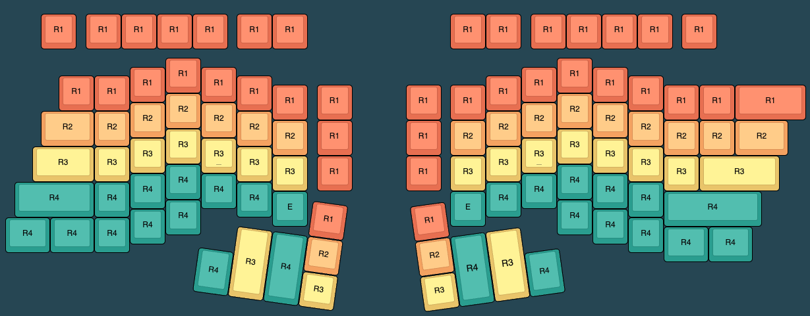

# ErgoDonk Zero Keyboard

ErgoDonk Zero is a 6×9+6 keys split ortholinear keyboard with encoder & solenoid support, hotswap sockets for MX or Choc v1 low profile switches, and uses the RP2040 "Zero" MCU.

The ErgoDonk Zero was designed by [Ryan Neff](https://github.com/JellyTitan). Many of the footprints came from the well-regarded foostan [kbd library](https://github.com/foostan/kbd). 

## Overview
The ErgoDonk Zero was designed to be a good first split ortholinear keyboard. It is inexpensive, the parts are accessable, it's easy to build, and has a key layout that is still familiar to non-split querty users. 

It can be used with any MX [keycap profile](https://www.reddit.com/r/MechanicalKeyboards/comments/j484j5/keycap_profiles_i_compiled_a_direct_comparison/), but is designed specifically for the ergonomic SA Keycap profile. The E0 has been designed to use off the shelf keycap sets. The layout leverages the variable height profile of SA keycaps. 
 @todo get image of the SA profiles from the thumb and sides.

[](http://www.keyboard-layout-editor.com/##@_backcolor=%23264653&name=ErgoDonk%20Zero%20Keycap%20heights&author=https%2F:%2F%2F%2F%2Fgithub.com%2F%2Fjellytitan%3B&@_y:0.25&x:1&c=%23e76f51&a:7%3B&=R1&_x:0.25%3B&=R1&=R1&=R1&=R1&_x:0.25%3B&=R1&=R1&_x:4%3B&=R1&=R1&_x:0.25%3B&=R1&=R1&=R1&=R1&_x:0.25%3B&=R1%3B&@_y:0.25&x:4.5%3B&=R1&_x:10%3B&=R1%3B&@_y:-0.75&x:3.5%3B&=R1&_x:1%3B&=R1&_x:8%3B&=R1&_x:1%3B&=R1%3B&@_y:-0.75&x:1.5%3B&=R1&=R1&_x:3%3B&=R1&_x:6%3B&=R1&_x:3%3B&=R1%3B&@_y:-0.75&x:7.5%3B&=R1&_x:0.25%3B&=R1&_x:1.5%3B&=R1&_x:0.25%3B&=R1&_x:5%3B&=R1&=R1&_w:2%3B&=R1%3B&@_y:-0.75&x:4.5&c=%23f4a261%3B&=R2&_x:10%3B&=R2%3B&@_y:-0.75&x:3.5%3B&=R2&_x:1%3B&=R2&_x:8%3B&=R2&_x:1%3B&=R2%3B&@_y:-0.75&x:1&w:1.5%3B&=R2&=R2&_x:3%3B&=R2&_x:6%3B&=R2&_x:3%3B&=R2%3B&@_y:-0.75&x:7.5%3B&=R2&_x:0.25&c=%23e76f51%3B&=R1&_x:1.5%3B&=R1&_x:0.25&c=%23f4a261%3B&=R2&_x:5%3B&=R2&=R2&_w:1.5%3B&=R2%3B&@_y:-0.75&x:4.5&c=%23e9c46a%3B&=R3&_x:10%3B&=R3%3B&@_y:-0.75&x:3.5%3B&=R3&_x:1&n:true%3B&=R3&_x:8&n:true%3B&=R3&_x:1%3B&=R3%3B&@_y:-0.75&x:0.75&w:1.75%3B&=R3&=R3&_x:3%3B&=R3&_x:6%3B&=R3&_x:3%3B&=R3%3B&@_y:-0.75&x:7.5%3B&=R3&_x:0.25&c=%23e76f51%3B&=R1&_x:1.5%3B&=R1&_x:0.25&c=%23e9c46a%3B&=R3&_x:5%3B&=R3&_w:2.25%3B&=R3%3B&@_y:-0.75&x:4.5&c=%232a9d8f%3B&=R4&_x:10%3B&=R4%3B&@_y:-0.75&x:3.5%3B&=R4&_x:1%3B&=R4&_x:8%3B&=R4&_x:1%3B&=R4%3B&@_y:-0.75&x:0.25&w:2.25%3B&=R4&=R4&_x:3%3B&=R4&_x:6%3B&=R4&_x:3%3B&=R4%3B&@_y:-0.75&x:7.5%3B&=E&_x:4%3B&=E&_x:5&w:2.75%3B&=R4%3B&@_y:-0.75&x:4.5&p=R1%3B&=R4&_x:10%3B&=R4%3B&@_y:-0.75&x:3.5%3B&=R4&_x:12%3B&=R4%3B&@_y:-0.75&w:1.25%3B&=R4&_w:1.25%3B&=R4&=R4&_x:14%3B&=R4%3B&@_y:-0.75&x:18.5&w:1.25%3B&=R4&_w:1.25%3B&=R4%3B&@_r:8&rx:10.6&ry:1&y:4.75&x:-1.3000000000000007&c=%23e76f51%3B&=R1%3B&@_x:-3.3&c=%23e9c46a&h:2%3B&=R3&_c=%232a9d8f&h:2%3B&=R4&_c=%23f4a261%3B&=R2%3B&@_y:-0.25&x:-4.3&c=%232a9d8f&h:1.25%3B&=R4%3B&@_y:-0.75&x:-1.3000000000000007&c=%23e9c46a%3B&=R3%3B&@_r:-8&y:-3&x:0.09999999999999964&c=%23e76f51%3B&=R1%3B&@_x:0.09999999999999964&c=%23f4a261%3B&=R2&_c=%232a9d8f&fa@:4%3B&h:2%3B&=R4&_c=%23e9c46a&f:4&h:2%3B&=R3%3B&@_y:-0.25&x:3.0999999999999996&c=%232a9d8f&f:3&h:1.25%3B&=R4%3B&@_y:-0.75&x:0.09999999999999964&c=%23e9c46a%3B&=R3)

## Design philosophy
The ErgoDonk Zero is designed with the following goals:
* Comfort & ergonomics
  * Ortholinear.
  * Split.
  * Tiltable. Has tenting puck mounting holes. [SplitKB](https://splitkb.com/products/tenting-puck) or 3d print your own: design by [
Bubbleology](https://www.printables.com/model/235433-tenting-puck-for-keyboard-tripod-mount/comments/943096).
  * Thumb clusters designed to use SA variable height keycaps
* Accessible
  * Uses standard key cap sets. 
  * Can use either MX or Choc V1 low profile key switches.
  * Through-hole components used for easy soldering.
  * "Drag and drop" MCU flashing.
  * Uses VIA for easy customization.
  * [Supports more keys](http://www.keyboard-layout-editor.com/#/gists/ac776db3b0deef94de51943c384cfdfc) than a traditional split ergo, making it a good transition to a smaller split, or for those who really like their "F" keys.
* Low cost
  * The PCB is reversible to reduce manufacturing costs.
  * Uses RP2040 Zero. (Inexpensive clones are readily available for ~$3USD)
  * Does not require expensive split-specific key cap sets.
